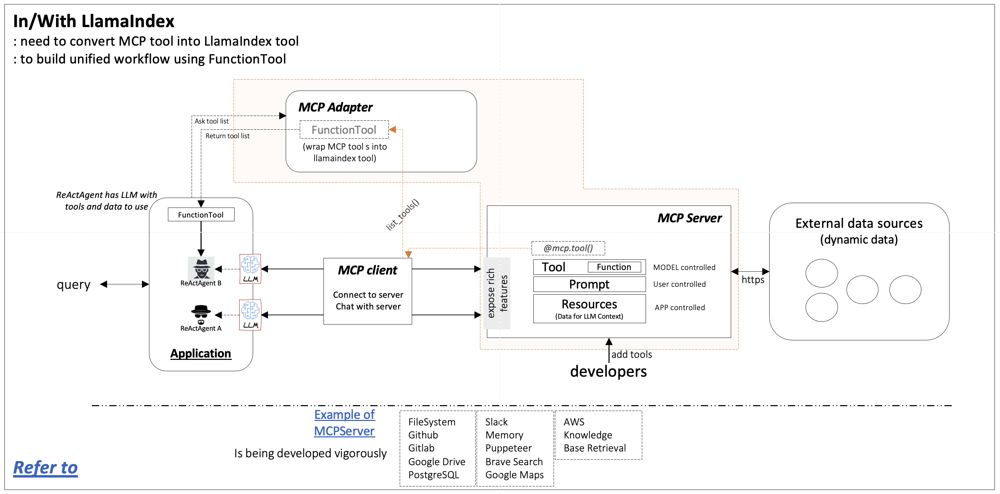

# Implementation 


Implementing the conversion of MCP tools to LlamaIndex tools mainly includes the following steps:

#### Communicate with MCP server:
Establish a connection with the MCP server using the MCPClient class, at least support list_tools and call_tool methods.
See  for reference.

#### Construct adapter:
Define the MCPToolAdapter class, which uses the MCPClient’s list_tools method to get the tool list and uses the FunctionTool.from_defaults method in LlamaIndex to wrap each MCP tool into a LlamaIndex tool.
See  for reference.

#### Use the adapter in LlamaIndex:
In LlamaIndex, use the adapter to get tools, and then use the agent to call the tools.
See  for reference.




#### How to convert MCP tool into LlamaIndex tool

```
from typing import Any, Dict, List, Optional, Type
from llama_index.core.tools import FunctionTool
from mcp_client import MCPClient
from pydantic import BaseModel, Field, create_model

json_type_mapping: Dict[str, Type] = {
    "string": str,
    "number": float,
    "integer": int,
    "boolean": bool,
    "object": dict,
    "array": list
}

def create_model_from_json_schema(schema: Dict[str, Any], model_name: str = "DynamicModel") -> Type[BaseModel]:
    properties = schema.get("properties", {})
    required_fields = set(schema.get("required", []))
    fields = {}

    for field_name, field_schema in properties.items():
        json_type = field_schema.get("type", "string")
        field_type = json_type_mapping.get(json_type, str)

        if field_name in required_fields:
            default_value = ...
        else:
            default_value = None
            field_type = Optional[field_type]

        fields[field_name] = (field_type, Field(default_value, description=field_schema.get("description", "")))

    dynamic_model = create_model(model_name, **fields)
    return dynamic_model


class MCPToolAdapter:
    def __init__(self, client: MCPClient):
        self.client = client

    async def list_tools(self) -> List[FunctionTool]:
        response = await self.client.list_tools()
        return [
            FunctionTool.from_defaults(
                fn=self._create_tool_fn(tool.name),
                name=tool.name,
                description=tool.description,
                fn_schema=create_model_from_json_schema(tool.inputSchema),
            )
            for tool in response.tools
        ]

    def _create_tool_fn(self, tool_name: str):
        async def tool_fn(**kwargs):
            return await self.client.call_tool(tool_name, kwargs)

        return tool_fn
```
